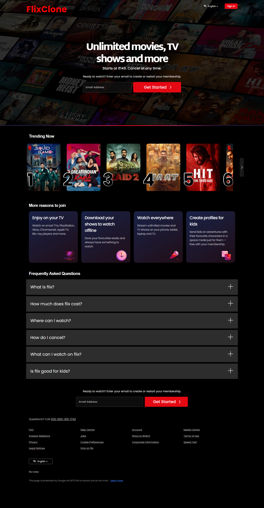

# 🎬 Netflix Sign-Up Page Clone

  A responsive front-end clone of Netflix’s sign-up page built with HTML, CSS, and JavaScript. This project replicates the modern UI design of Netflix’s sign-up flow — simple, sleek, and mobile-friendly.

## 🚀 Features

  - 🔥 Clean and modern Netflix-style design

  - 📱 Fully responsive for all screen sizes

  - 🎨 Smooth hover effects and animations

  - 💡 Structured layout inspired by Netflix’s official sign-up page

  - ⚡ Lightweight and fast — no frameworks used

## 🛠️ Tech Stack

  - HTML5 – structure

  - CSS3 – styling and responsiveness

  - JavaScript – for basic interactivity (like animations)

## 💻 How to Use

1. Clone this repository

    ```bash

    git clone https://github.com/Harsimrankaur2004/flix-signup-ui-clone


2. Open the folder

    ```bash

    cd flix-signup-ui-clone


3. Launch the project

  - Just open index.html in your browser

  - Or use a live server extension (VS Code → “Go Live”)

## 🌐 Live Demo

🔗 [Click here to view the site](https://flix-signup-clone-ui-project.netlify.app/)

## 📸 Screenshot

  

## 🧾 License

This project is open-source and available under the MIT License.

[](https://opensource.org/licenses/MIT)